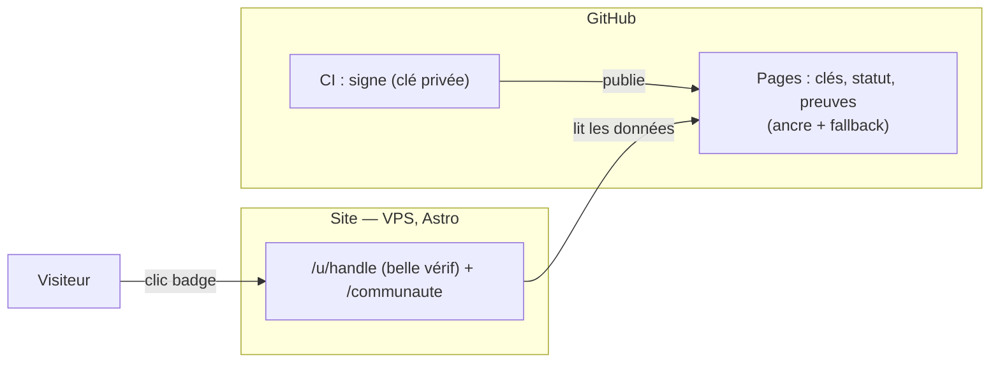
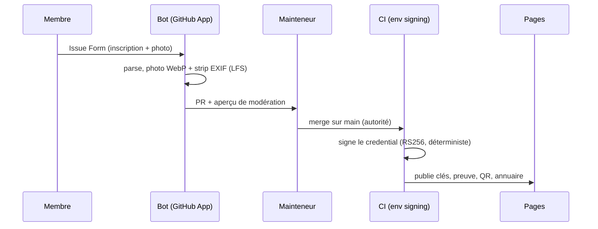
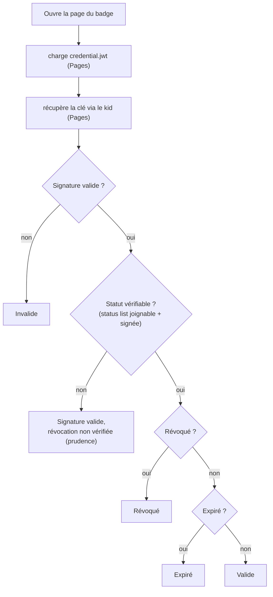
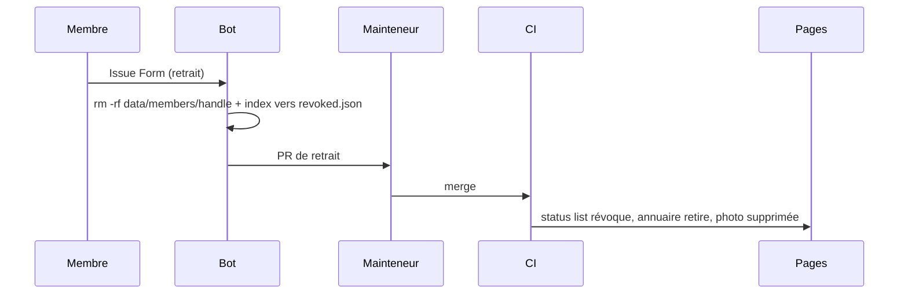
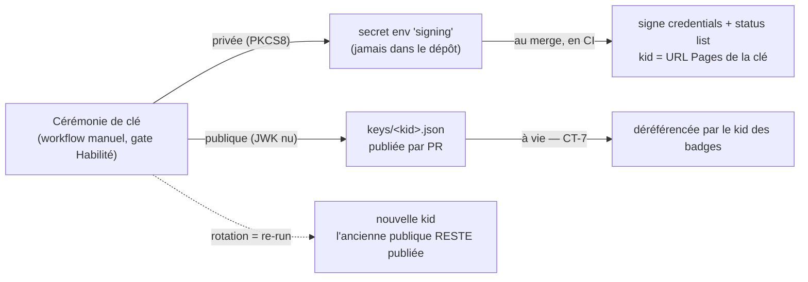

# Architecture

## Deux couches

| Couche | Où | Rôle |
|---|---|---|
| **Données** | GitHub **Pages** (`ai-driven-dev.github.io/badges`) | Clés, statut, issuer, preuves, photos. L'**ancre permanente** (uptime GitHub) et le **fallback**. |
| **Affichage** | Le **site** (VPS, Astro : `verify.ai-driven-dev.fr`) | La **belle** page de vérif + le badge visuel + l'annuaire `/communaute`. Lit les données depuis Pages. |

Le badge (et son QR) pointent vers la belle page du **site**. Si le site tombe, la
preuve reste vérifiable via Pages — c'est le fallback. La **génération/signature** est
de la CI GitHub (la clé privée n'est jamais sur un serveur).

## Inscription → émission

Le merge par un mainteneur **est** le point d'autorité : il déclenche la signature.

## Vérification (dans le navigateur, indépendante)

> Fail-safe : on n'affirme jamais « valide » sans avoir écarté une révocation. Si le
> status list est injoignable ou non authentifiable, l'état est **prudent**, pas valide.

## Retrait RGPD

## Données d'un membre

`data/members/<handle>/record.yml` (fiche) + `photo.webp` (objet Git LFS). L'effacement
RGPD = `rm -rf data/members/<handle>/`. La révocation survit dans `data/revoked.json`
(juste des entiers, non personnels). Schéma des champs : `PRD.md`.

## Clé de signature — cycle de vie

Une paire RS256. Le `kid` = thumbprint RFC 7638 de la clé publique, donc il ne peut
jamais diverger de la clé (l'émission le re-dérive à chaque build).

- **Génération** : workflow manuel `key-ceremony`, gaté par une review *Habilité*. La
  privée part en secret `SIGNING_PRIVATE_KEY` (env `signing`) ; la publique est publiée
  par une PR de clé. L'émission ne se fait qu'après le merge de cette PR.
- **Rotation** : re-jouer la cérémonie. Une nouvelle `kid` sert les émissions suivantes.
- **Révoquer une clé — nuance** : on ne supprime **jamais** `keys/<kid>.json`. Retirer
  une clé publique rendrait invérifiables **tous** les badges signés avec (CT-7). Donc :
  - « retirer » une clé = **rotation** (arrêter de signer avec l'ancienne) ;
  - **compromission** = rotation **et** révocation, via la status list, de **tous** les
    badges signés par la clé compromise (un attaquant pourrait forger avec elle), puis
    ré-émission des membres légitimes sous la nouvelle clé.
