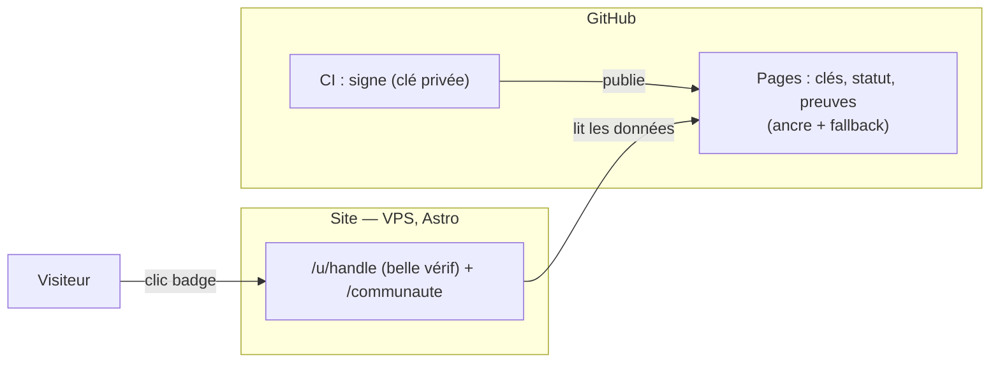
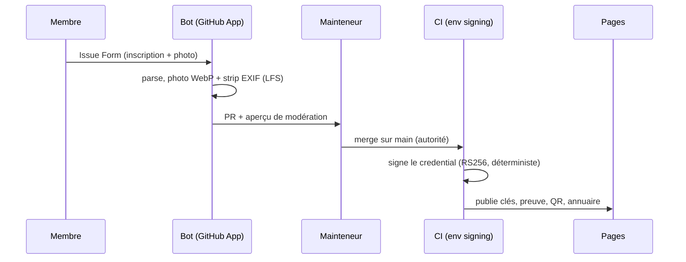
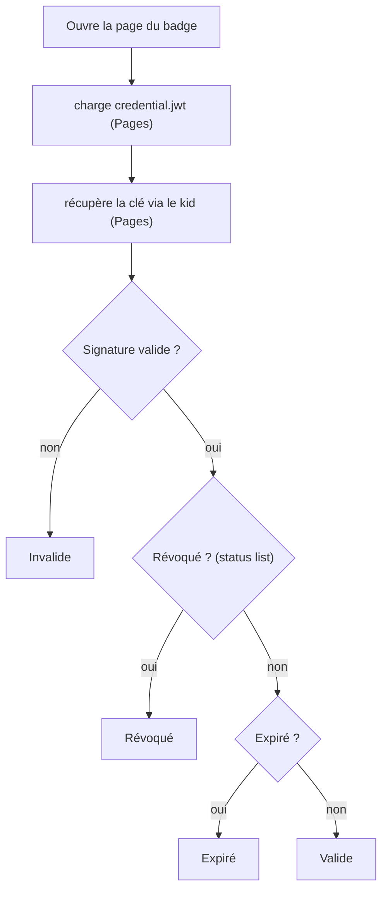
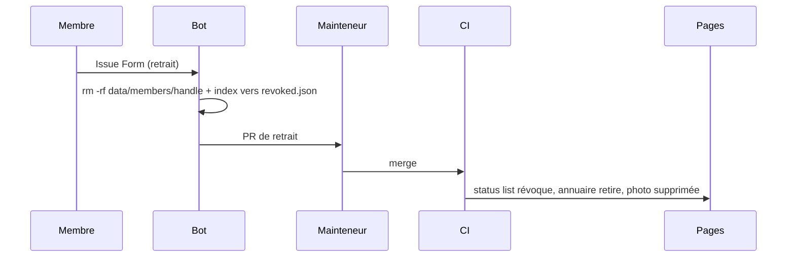

# Architecture

## Deux couches

| Couche | Où | Rôle |
|---|---|---|
| **Données** | GitHub **Pages** (`ai-driven-dev.github.io/badges`) | Clés, statut, issuer, preuves, photos. L'**ancre permanente** (uptime GitHub) et le **fallback**. |
| **Affichage** | Le **site** (VPS, Astro : `verify.ai-driven-dev.fr`) | La **belle** page de vérif + le badge visuel + l'annuaire `/communaute`. Lit les données depuis Pages. |

Le badge (et son QR) pointent vers la belle page du **site**. Si le site tombe, la
preuve reste vérifiable via Pages — c'est le fallback. La **génération/signature** est
de la CI GitHub (la clé privée n'est jamais sur un serveur).

## Inscription → émission

Le merge par un mainteneur **est** le point d'autorité : il déclenche la signature.

## Vérification (dans le navigateur, indépendante)

## Retrait RGPD

## Données d'un membre

`data/members/<handle>/record.yml` (fiche) + `photo.webp` (objet Git LFS). L'effacement
RGPD = `rm -rf data/members/<handle>/`. La révocation survit dans `data/revoked.json`
(juste des entiers, non personnels). Schéma des champs : `PRD.md`.

## Clé de signature

Une paire RS256. La **privée** vit en secret d'environnement CI (`signing`), utilisée
seulement au merge ; jamais dans le dépôt. La **publique** est publiée à vie
(`keys/<kid>.json`) : retirer une ancienne clé rendrait ses badges invérifiables.
Rotation : un workflow manuel gaté par une review Habilité (`key-ceremony`).
