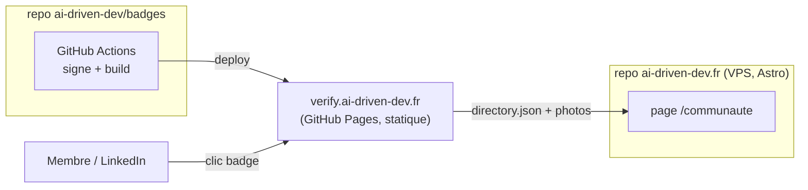
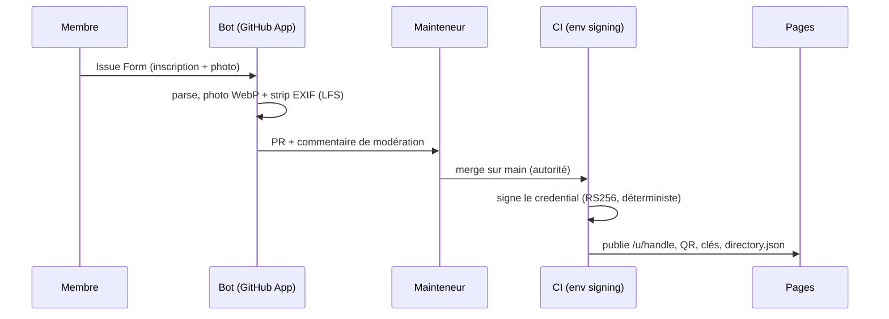
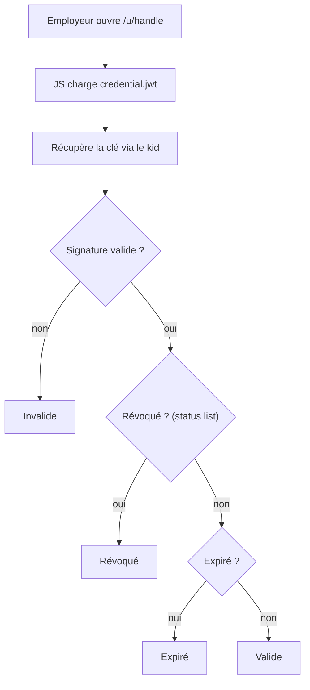
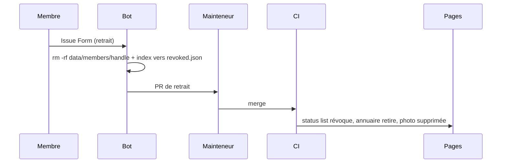
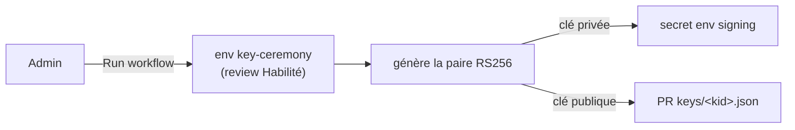

# Processus

Les flux du système, en clair. Détail des contraintes : `PRD.md`.

## Architecture (deux dépôts)

Ce dépôt = la **machinerie + les données** (signature, vérif, flux). Le site
`ai-driven-dev.fr` = l'**affichage** (`/communaute`). La génération est de la CI,
pas un serveur — seul `verify.ai-driven-dev.fr` (Pages, statique) a une URL publique.

## Inscription → émission

Le formulaire crée une issue ; le bot en fait une PR (fiche + photo normalisée + commentaire de
modération). **Le merge par un mainteneur est le point d'autorité** : il déclenche l'émission signée.

## Vérification (côté navigateur, indépendante)

La page charge la preuve, récupère la clé via le `kid`, **vérifie la signature dans le
navigateur**, puis contrôle révocation et expiration. Aucun serveur AIDD n'intervient.

## Retrait RGPD

Le retrait **supprime tout le dossier** du membre (fiche + photo LFS) et inscrit son
`status_index` au registre `revoked.json` — le badge reste révoqué à vie. Une preuve
déjà exportée apparaît **révoquée** à la vérif (seule voie).

## Cérémonie de clé (init / rotation)

Manuelle, rare, gatée par une review Habilité. La clé privée est générée dans le runner,
déposée en secret, jamais vue ni committée. Les clés publiques passées restent publiées à vie.

